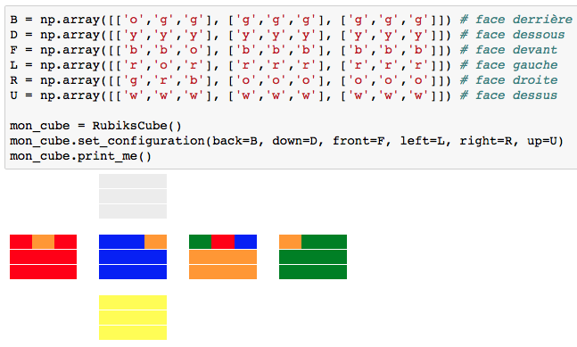
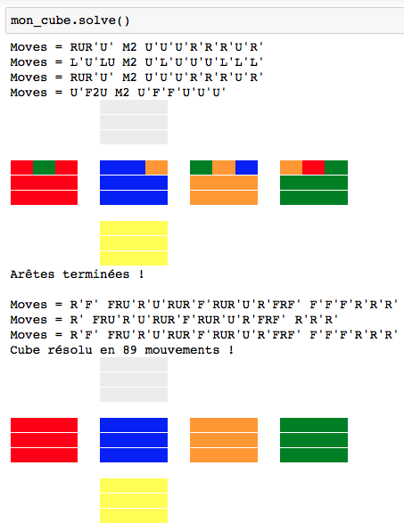

<h1 align = 'center'>Résolution d'un Rubik's Cube</h1>

## Usage
Renseigner individuellement la couleur de chaque face. Les couleurs sont à fournir par initiales, en anglais. Par exemple, bleu devient "b", vert devient "g", etc. 

Les faces doivent être renseignées de gauche à droite, du haut vers le bas. Le cube doit être tenu avec la face blanche au dessus et la face bleue devant. 

La résolution se fait d'abord sur les arêtes, puis sur les coins. Il suffit de suivre la séquence de mouvements qui s'affiche à l'écran.

